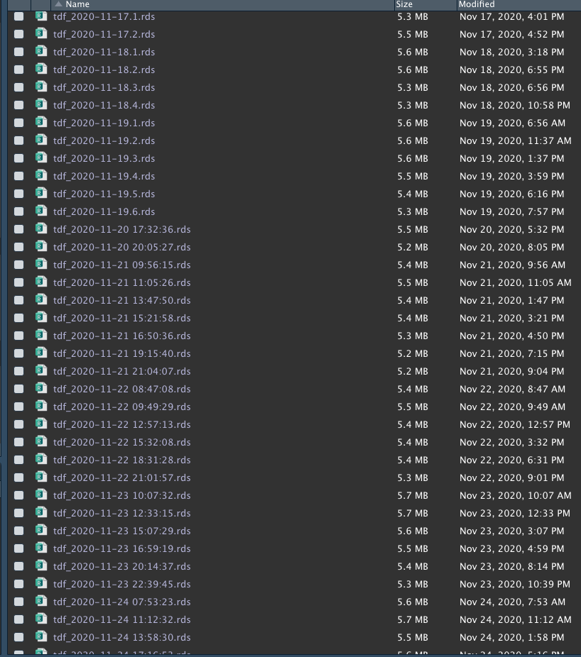
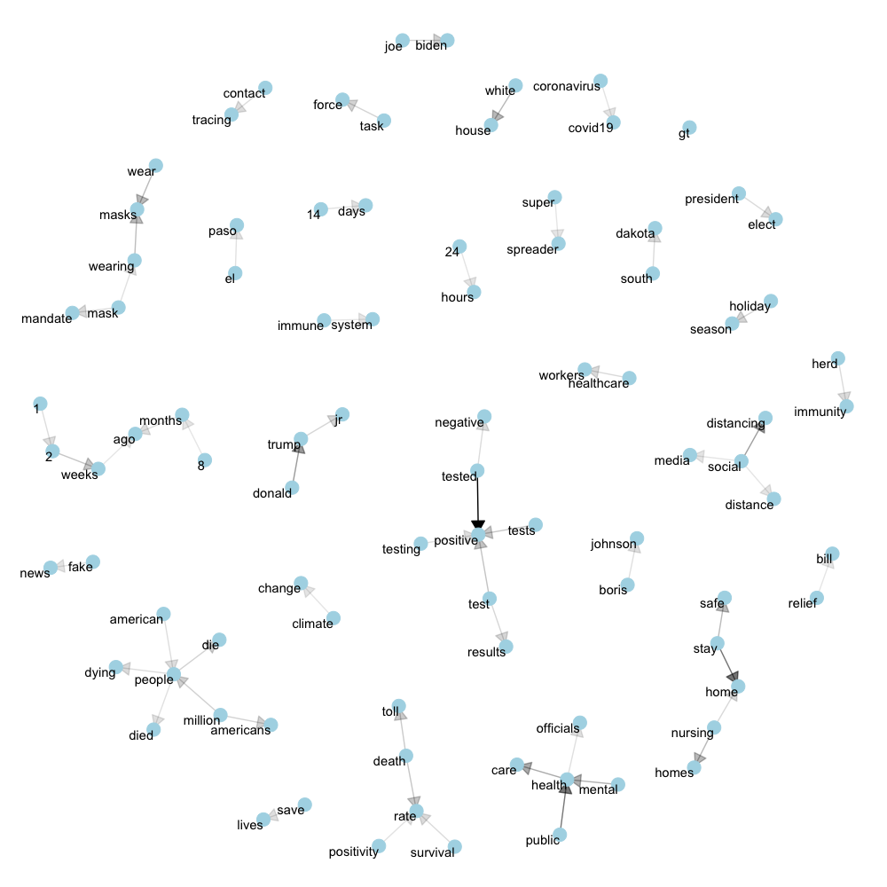

## Objective

Twitter data is used to study **Covid-19** related **mental health sentiments**. In the past, a lot of studies has done on studying social behaviors using the social media data. In this study, we are investigating how **Covid-19** is influencing people's **mental health** through tweets. Since we are working with texts, natural language processing and text analysis is be used to clean the text data and tokenize words that are related to users' sentiments that reflects the status of mental health.


## Set Up

```{r message=FALSE, warning=FALSE, paged.print=FALSE}
#library packages
for (pkg in c("psych", "ggplot2", "dplyr", "data.table", "twitteR", "tidytext", "tidyverse", "rtweet", "mosaic","wordcloud","wordcloud", "RColorBrewer", "wordcloud2", "DT","igraph", "ggraph")) {
  library(pkg, character.only = TRUE)
}
```

## Twitter API is used for Data Scraping on Twitter

### Apply and receive approval for a developer account


### Set up API key and tokens

*Pleas do not copy*

```{r eval=FALSE, include=TRUE, message=FALSE, warning=FALSE, paged.print=FALSE}
api_key <- "eV0nQh8tFwJLF6JCf0SzGghi5"
api_secret_key <- "BO2cXph7xRojBes9tcg9uJaOrcDypRYxSf7abMe5Wrx6OmS8Pk"
bearer_token <- "AAAAAAAAAAAAAAAAAAAAAM5FIwEAAAAAK0njC1bUNBJyHVa3RZhmki2LKZI%3Dho3epZaYUM5KkRbFSERPAUmqI7Ycwqwlq1E7KS7FOsgkUuuypr"

consumer_key <- api_key
consumer_secret <-api_secret_key
access_token <- "2311731293-riYHv8BowECPCsqYsZBGeAPzwatxWuXokScWDfj"
access_secret <- "dcp3hitpg2BbY7NQd2u6UsDUrAumQPTPaXRtDm1h8JAGy"

#twitteR
setup_twitter_oauth(consumer_key, consumer_secret, access_token, access_secret)

#rtweet
twitter_token <- create_token(
   app = "covid-19 mental health",
    consumer_key = api_key,
    consumer_secret = api_secret_key,
   access_token =access_token ,
   access_secret = access_secret)
```

## Set up Tweet scrapping criteria

- exclude retweets
- include keyword: covid'
- pull most recent tweets
- include language that is english 

```{r eval=FALSE, include=TRUE, message=FALSE, warning=FALSE, paged.print=FALSE}
rt <- search_tweets(q="covid", #keyword
                    n=18000, #max tweets
                    type = "recent", #most recent tweets
                    include_rts = FALSE, #no retweets
                    lang = "en")

rt <- as.data.frame(rt)
date <- Sys.time() 
saveRDS(rt, file= paste("data/tdf_",date,".rds", sep = ""))
```


### Example of Scrapped files

{width=55%}

- Timeline: scrapped from 11/17 to 11/25 for 9 days. Day 1 and Day 2 served as a practice run. From Day 3 to Day 9 (7 days), we scrapped on average 5 times throughout the day, with an 2 hour interval. 

- Each time, about 18,000 tweets were scrapped.  

- In total, we scrapped 754,093 tweets (excluding retweets).  

- Stored in local environment


## Combining multiple Rds files

- Built an automatic process to read in all files with certain pattern in a folder.

- Combine 42 data objects into one dataframe. Datafame has dimension: 754,093 rows and 90 columns. File size is 226.5 MB. 

```{r eval=FALSE, message=FALSE, warning=FALSE, include=TRUE, paged.print=FALSE}
knitr::opts_chunk$set(echo = TRUE)
knitr::opts_knit$set(root.dir = "")

setwd("/data/")
getwd()

files <- list.files(pattern = "tdf_2020")

dat_list = lapply(files, function (x) readRDS(x))

df <- data.table::rbindlist(dat_list)

saveRDS(df, file="tdf_all.rds")
```

First, here is a glimpse of what data look like. 

```{r echo=FALSE, message=FALSE, warning=FALSE, paged.print=FALSE}
example1 <- readRDS("data/tdf_2020-11-17.1.rds")
example1 <- example1%>%
  filter(is.na(hashtags))%>%
  distinct_at(vars(user_id), .keep_all = T)%>%
  arrange(desc(display_text_width))
  
datatable(example1[1:10,])
```

## Text Analysis through natural language process (NLP)

### Data Cleaning Procedure

#### 1. Tokenization

Break the text into individual tokens and transform it to a tidy data structure. To do this, we use tidytext’s `unnest_tokens()` function.

Punctuation has been deleted.

All uppercase words have been converted to lowercase.


#### 2. Count the occurance of each token and identify the most frequent tokens.


#### 3. Exclude Stop words.

We built up stop words from the original stop words dictionary from the lexicon package

```{r, echo=FALSE, results='asis'}
datatable(stop_words)
```


Add aditional stop words that are unique to the twitter data 

```{r eval=FALSE, include=TRUE, message=FALSE, warning=FALSE, paged.print=FALSE}
my_stop_words <- stop_words %>% 
  bind_rows(data.frame(word = c("https", "t.co", "rt", "19", "covid", "covid_19","it’s", "i’m", "due", "don’t")))%>% 
  select(-lexicon) 
```

### Pipeline code 

```{r eval=FALSE, include=TRUE, message=FALSE, warning=FALSE, paged.print=FALSE}
word_c <- tdf_all%>%
  mutate(date = as.Date(created_at))%>%  
  select(text)%>% 
  unnest_tokens(word,text) %>% 
  group_by(date, word)%>%
  summarize(n = n())%>%
  arrange(desc(n))%>%
  anti_join(my_stop_words)
```


```{r echo=FALSE}
tweet_words_clean_ls <- readRDS("tweet_words_clean_ls.rds")

word_c <- tweet_words_clean_ls$word_c

word_raw <- tweet_words_clean_ls$word_raw
```

# Chapter 1. Token (Single word)

#### wordclouds
```{r fig.width=7, fig.height=7, fig.align='center'}
set.seed(1)
wordcloud(words = word_c$word, 
          freq = word_c$n, 
          min.freq = 1,  
          max.words=200, random.order=FALSE, rot.per=0.35,           
          colors=brewer.pal(8, "Dark2"),
          scale=c(6,0.4))
```

## Sentiment Analysis

Get specific sentiment lexicons in a tidy format, with one row per word, in a form that can be joined with a one-word-per-row dataset.

```{r}
bing <- get_sentiments("bing") # positive or negative
loughran <- get_sentiments("loughran") #6 sentiments
nrc <- get_sentiments("nrc") #10 sentiment 
afinn <- get_sentiments("afinn") #ranking from negative to positive
```

### 1. Bing Sentiment Lexicon

Created by Bing Liu and collaborators. Lexicon for opinion and sentiment analysis. Two types of sentiments: positive and negative


```{r}
sentiment_bing <- word_c %>%
  inner_join(bing)%>%
  filter(word != "trump")

sentiment_bing %>%
  group_by(sentiment) %>%
  top_n(10, n) %>%
  ungroup() %>%
  mutate(word = reorder(word, n)) %>%
  ggplot(aes(n, word, fill = sentiment)) +
  geom_col(show.legend = FALSE) +
  facet_wrap(~sentiment, scales = "free_y") +
  labs(x = "Contribution to sentiment",
       y = NULL)
```

### 2. Loughran-McDonald Sentiment Lexicon

English sentiment lexicon created for use with financial documents. This lexicon labels words with six possible sentiments important in financial contexts: "negative", "positive", "litigious", "uncertainty", "constraining", or "superfluous". ^[https://rdrr.io/cran/textdata/man/lexicon_loughran.html]


```{r}
sentiment_loughran <- word_c %>%
  inner_join(loughran)

sentiment_loughran %>%
  group_by(sentiment) %>%
  top_n(10, n) %>%
  ungroup() %>%
  mutate(word = reorder(word, n)) %>%
  ggplot(aes(n, word, fill = sentiment)) +
  geom_col(show.legend = FALSE) +
  facet_wrap(~sentiment, scales = "free_y") +
  labs(x = "Contribution to sentiment",
       y = NULL)
```

### 3. NRC Emotion Lexicon

Sentiments: negative, positive.

Emotions: anger, anticipation, disgust, fear, joy, sadness, surprise, trust

#### NRC Emotion Lexicon has been implemented in^[https://saifmohammad.com/WebPages/NRC-Emotion-Lexicon.htm]

##### Well-Being and Health Disorders
Used in work on understanding pandemic response, feelings towards influenza vaccinations, depression detection, hate speech detection, identifying cyber-bullying, etc.

##### Psychology, Behavioural Science, Psycolinguistics, Fairness, and Social Science
Used in work on understanding how people express emotions, relationships between word characteristics (such as length and concreteness) with its associated emotion, gender attitudes, as well as the role of emotions in the spread of information, especially news, fake news, and viral videos. The highly cited paper "The spread of true and false news online" uses the lexicon to determine associations of emotions with fake news and its virality.

```{r fig.width=7, fig.height=7, fig.align='center'}
sentiment_nrc <- word_c%>%
  inner_join(nrc, by = "word")

sentiment_nrc %>%
  group_by(sentiment) %>%
  top_n(10, n) %>%
  ungroup() %>%
  mutate(word = reorder(word, n)) %>%
  ggplot(aes(n, word, fill = sentiment)) +
  geom_col(show.legend = FALSE) +
  facet_wrap(~sentiment, scales = "free_y", ncol = 3 ) +
  labs(x = "Contribution to sentiment",
       y = NULL)+
  theme_minimal()
```

### 4. Affin Sentiment Lexicon

The Afinn lexicon assigns words with a score that runs between -5 and 5, with negative scores indicating negative sentiment and positive scores indicating positive sentiment.

```{r fig.width=7, fig.height=6, fig.align='center'}
sentiment_afinn <- word_c%>%
  inner_join(afinn, by = "word")%>%
  arrange(desc(n))%>%
  mutate(pos = value >= 0)

word_level <- sentiment_afinn$word
sentiment_afinn$word <- factor(sentiment_afinn$word, levels = word_level)

sentiment_afinn%>%
  top_n(40,n)%>%
ggplot(aes(x = word, y = value, fill=value))+
 # geom_point()  +
  geom_col(position = "identity")+
  theme(legend.position = "right") +
  labs(title = "")+
  theme_minimal()+
  scale_fill_manual(values = c("#CCEEFF", "#FFDDDD"), guide = FALSE)+
  scale_fill_gradient2(midpoint=0, low="blue", mid="white",high="red", space ="Lab" )+
  theme(axis.text.x = element_text(angle = 90, vjust = 0.5, hjust=1))+
  ylim(-4,4)+
  theme(text = element_text(size=12))
```


# Chapter 2. Bigram

Previously, we have seen the analysis of single words, and considered their relationships to sentiments of Covid. However, some term need to be evaluated together such as "tested positive" does not reflect a positive sentiment. 

**Bigram** are tokenized pairs of adjacent words. 

**N-gram** are tokenized consecutive sequences of words. Bigram is a case of N-gram when n = 2. 

`unnest_tokens` function is being used to tokenize n-grams.   

## Excluding stop words in a sequence
- 1. separate bigrams into 2 words, word 1, word 2
- 2. exclude stop words in word 1
- 3. exclude stop words in word 2
- 4. combine cleaned word 1 and word 2

```{r eval=FALSE, include=TRUE, message=FALSE, warning=FALSE, paged.print=FALSE}
bigram <- tdf_all%>%
  mutate(date = as.Date(created_at))%>%  
  select(text, date)%>%
  unnest_tokens(bigram, text, token = "ngrams", n = 2)%>% 
  group_by(bigram)%>%
  summarize(n = n())%>%
  arrange(desc(n))

# exclude stop word
bigram_cleaned <- bigram_count%>%
  separate(bigram, c("word1", "word2"), sep = " ")%>%
  filter(!word1 %in% my_stop_words$word) %>%
  filter(!word2 %in% my_stop_words$word)%>%
  unite(bigram, word1, word2, sep = " ")
```

```{r echo=FALSE}
bigram_df <- readRDS("bigram_clean.rds")%>%
  filter(n > 1)
```

#### wordclouds
```{r fig.align='center', fig.height=8, fig.width=8, message=FALSE, warning=FALSE, paged.print=FALSE}
set.seed(1)
wordcloud(words = bigram_df$bigram, 
          freq = bigram_df$n, 
          min.freq = 1,  
          max.words=100, random.order=FALSE, rot.per=0.35,           
          colors=brewer.pal(8, "Dark2"),
          scale=c(5,0.1))
```

```{r eval=FALSE, include=TRUE, message=FALSE, warning=FALSE, paged.print=FALSE}
bigram_df <- bigram_df%>%
  separate(bigram, c("word1", "word2"), sep = " ")

bigram_graph <- bigram_df%>%
  graph_from_data_frame()

set.seed(2020)
a <- grid::arrow(type = "closed", length = unit(.15, "inches"))

ggraph(bigram_graph, layout = "fr") +
  geom_edge_link(aes(edge_alpha = n), show.legend = FALSE,
                 arrow = a, end_cap = circle(.03, 'inches')) +
  geom_node_point(size = 5, color = "lightblue") +
  geom_node_text(aes(label = name), vjust = 1, hjust = 1) +
  theme_void()
```

{width=100%}

# Conclusion and Future Analysis

- Negative sentiments and negative emotions were identified with COVID related tweets. 

- In-depth analysis of bigram, including bigram sentiments

- Expand pool of Twitter scrapping data

- Study the trend of negative sentiment overtime. Study how people react to historical events such as vaccine avilability.  
